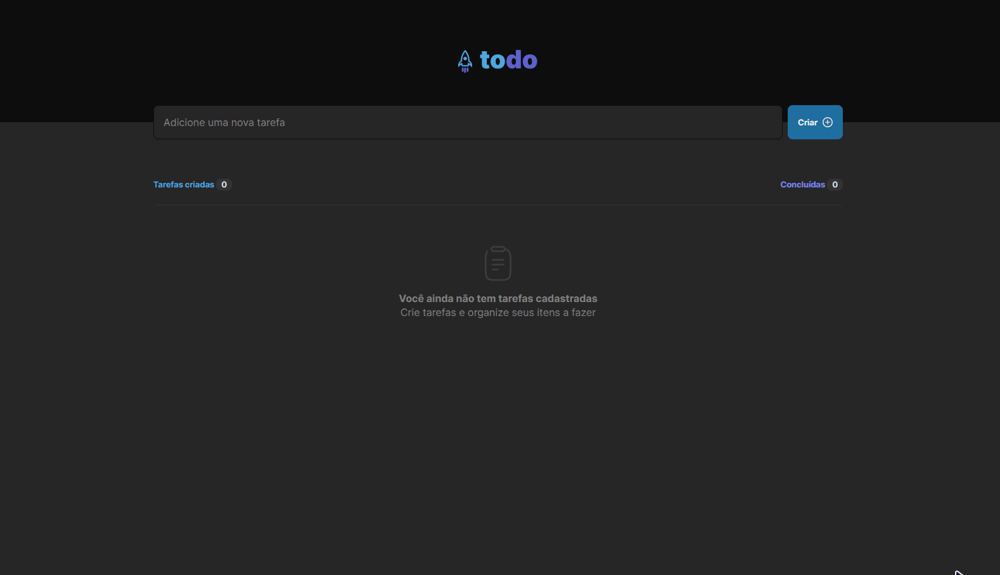

<h1 align="center">
  📖 Todo Web 📖
</h1>

<h3 align="center">
  Adicione suas tarefas
</h3>

## 📷 Preview do projeto

<div align="center">
  
</div>

## 🕵️ Sobre 

Todo App simples que foi criado para resolução do desafio do curso Ignite da Rocketseat. Essa aplicação apesar de simples é um excelente exemplo para praticar manipulação de estados.

## 🚀 Tecnologias

✔ [Vite](https://vitejs.dev/)
<br />
✔ [ReactJS](https://reactjs.org/)
<br />
✔ [TypeScript](https://www.typescriptlang.org/)

## 🎨 Layout

Você pode visualizar o layout do projeto através [desse link](https://www.figma.com/file/bRWwu6igVOsO5yplI3opQm/ToDo-List-Ignite-Challenge-1?type=design&node-id=0-1&t=U8OnyQ1ajtt6nJ5M-0). É necessário ter conta no [Figma](https://www.figma.com/) para acessá-lo.


## 🔍 Requisitos de software

<li><a href="https://git-scm.com">Git</a></li>
<li><a href="https://nodejs.org/en">Node.js</a></li>
<li><a href="https://yarnpkg.com/">Yarn</a> ou <a href="https://www.npmjs.com/">NPM</a></li>

## ⚙ Configurações

Para rodar o projeto, basta executar os seguintes comandos, em seu terminal com git

```bash
  # Faça um clone do repositório
  git clone <link-do-repositório>

  # Navegue até a pasta do projeto e baixe as dependências
  cd todo-web && yarn

  # Executar o projeto
  yarn dev
```
Após esses passos, irá abrir uma página no seu navegador para visualizar o projeto rodando no seu navegador.

## 📝 Licença
Esse projeto se encontra sob a licença <strong>MIT</strong>. Para mais informações, acesse o arquivo <strong>LICENSE</strong>.

<p>Made with 💜 by Leonardo Jorge<p>
<p>
    <a href="https://www.linkedin.com/in/leonardo-jorge-a88a561b6/" target="_blank">
        
    </a>
    <a href="mailto:leonardoti4437@gmail.com" target="_blank">
        
    </a>
</p>